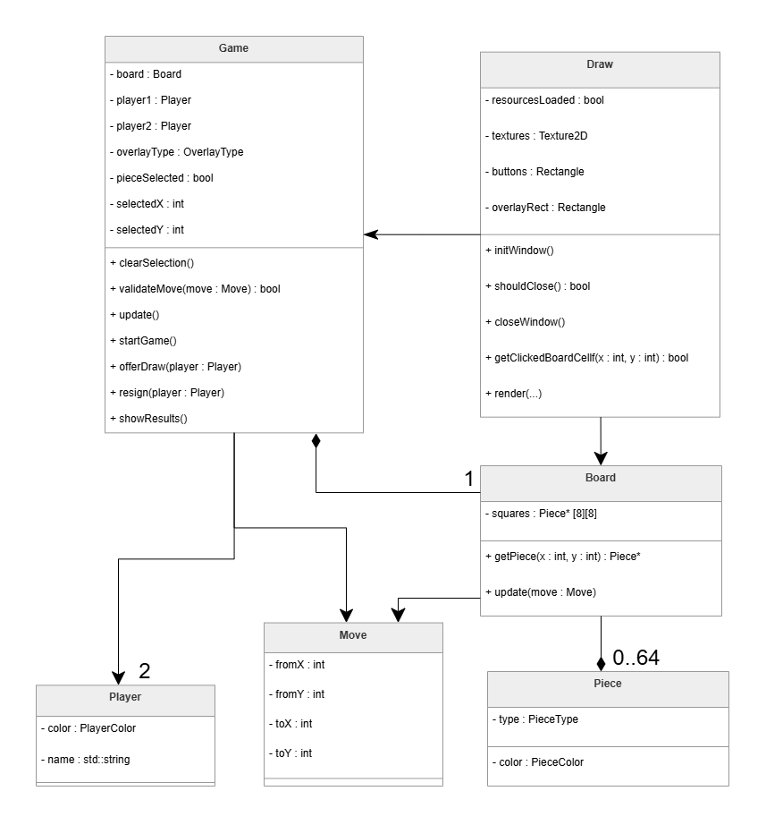

- [ ] ėjimo patikrinimas
- [ ] specialių atvejų patikrinimas (en passant, check(mate), castle)
- [ ] resign, draw, newGame funkcijos
- [ ] resign, draw turi būti užpildytas jau egzistuojantis overlay
- [ ] showResults() rodyti ėjimų istoriją, pan.
---
Jei nepasitikite, stockfish.exe yra https://stockfishchess.org/download/
---
Naujas UML otw
---

